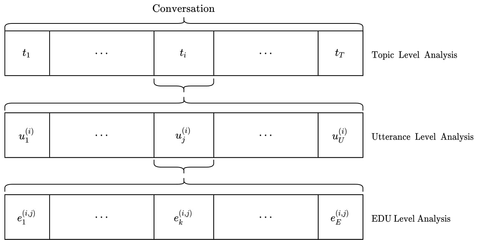

## Master's Project: What makes conversation interesting?

In this master's project I want to investigate what makes conversations interesting, and we are approaching this question from a new angle, using NLP.

Specifically, we are looking at the structure of conversation under 2 different lenses: as a macroscopic trajectory through a topic space (built from the components of word embeddings) and as a string of microscopic dialogue acts.

Our analysis is applied to a large corpus of conversations (the baseline) and compared statistically to "interesting" conversations, such as podcasts, interviews or movie-dialogue.

## Topic Segmentation and Embeddings

To do!

## Dialogue Act Classification

### What is a Dialogue Act?

Dialogue acts are an the social act that a phrase represents. An example would be

  * "Hello!" -> Greeting
  * "I think it's going to rain" -> Statement: opinion
  * "It rained yesterday" -> Statement: non-opinion
  * etc.

### How do we Automate it?

To automatically tag these dialogue acts, we rebuild the bi-lstm-crf model featured in [1]. The model encodes word embeddings into sentence-level embeddings using a bi-directional LSTM and then tags these sentence-level embeddings using another bi-directional LSTM layer and conditional random field (CRF) layer.

We train the model on the SWDA corpus.

We re-implemented the code because the code featured by the authors has not been maintained, rests on outdated tools and does not run.

### What do we do with it?
Once we have tagged a conversation transcript with corresponding dialogue acts, we can analyse them statistically, including:

  * Adjacency-pairs: given that DA x was just spoken, how will it be responded to and vice versa? How do people respond to yes or no questions, are wh-questions answered with facts or with opinions? etc.
  * Time series: are there global patterns in the evolution of a conversation such as greetings at the beginning/goodbyes at the end but more subtle?
  * Frequency analysis: Do interesting conversations contain more facts than the baseline? Maybe fewer? Do interviewers use a lot of yes/no questions? If so, then do the guests answer with yes or no or something else?
  * etc.

## References

[1] https://arxiv.org/abs/1709.04250
